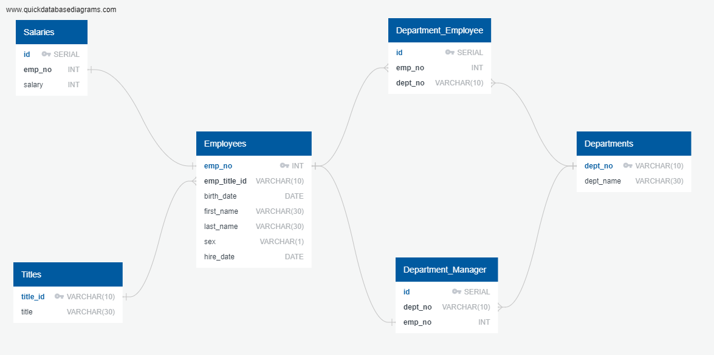

# SQL Challenge

## Objective
This is a research project on employees of a corporation from the 1980s and 1990s. Six CSV files contain all the relevant information. The objective is to create a data engineering and data analysis.

## Data Engineering
The following picture shows the relationships between each one of the available tables.

## Data Analysis
* List the following details of each employee: employee number, last name, first name, sex, and salary.

* List first name, last name, and hire date for employees who were hired in 1986.

* List the manager of each department with the following information: department number, department name, the manager's employee number, last name, first name.

* List the department of each employee with the following information: employee number, last name, first name, and department name.

* List first name, last name, and sex for employees whose first name is "Hercules" and last names begin with "B."

* List all employees in the Sales department, including their employee number, last name, first name, and department name.

* List all employees in the Sales and Development departments, including their employee number, last name, first name, and department name.

* In descending order, list the frequency count of employee last names, i.e., how many employees share each last name.

## Bonus
The most common salary ranges are between $40,000 and $50,000 for about 160,000 employees. 

The graph below presents the average salaries by titles. The Senior Engineer position earns less in average than the engineer, and the assistant engineer earns more than higher ranked engineers which is counter-intuitive. Also staff and Senior Staff earn more than the manager, which should be better analyzed depending on the company's structure.
The data seems to have flaws.

Finally, when looking for the employee # 499942, the first and last name appear as "April Foolsday" clearly indicating a fake database.

